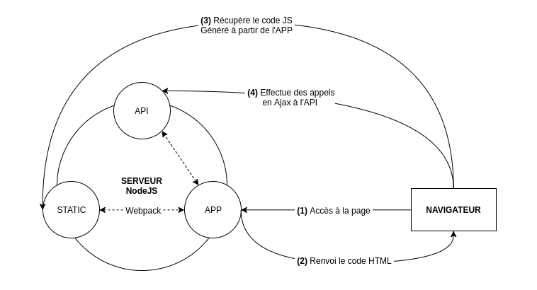

# NextJS

## Description

Framework React -> Serveur isomorphique (En gros : Serveur backend + Client frontend)

NB : Le schema ne represente pas le fonctionnement de NextJS

## Objectif
- Meilleur referencement (SEO)
- Application plus leger pour le client
- Page pré-rendu (HTML généré + JS injecté)

## Next Page VS Next App
Page
- Pré-rendu des pages (SSG/SSR/ISR)
- Injection du JS
- Proxy API intégré
- Fonctionnalité React : 
    - Utilisation des hooks
    - Mise en place de Redux identique
- Routing 
    - Dossier "page"
    - Tous les composants dans le dossier sont accessibles

App
- Pré-rendu des pages avec :
    - Composant Serveur
    - Composant Client
- Injection uniquement du JS des composant Client
- Proxy API intégré
- Possibilité de faire de la logique "Backend" dans les composants serveur
    - Appel DB
    - Variable privé (Clef API)
    - Le composant est executer coté serveur et le rendu est envoyé au client
- Fonctionnalité React : 
    - Utilisation des hooks limité uniquement au composant client
    - Utilisation des events du DOM limité au composant client
    - Mise en place particuliere de Redux (Accessible par les composants client mais pas serveur)
- Routing 
    - Dossier "app"
    - Uniquement les composants nommé "page" dans le dossier qui sont accessibles